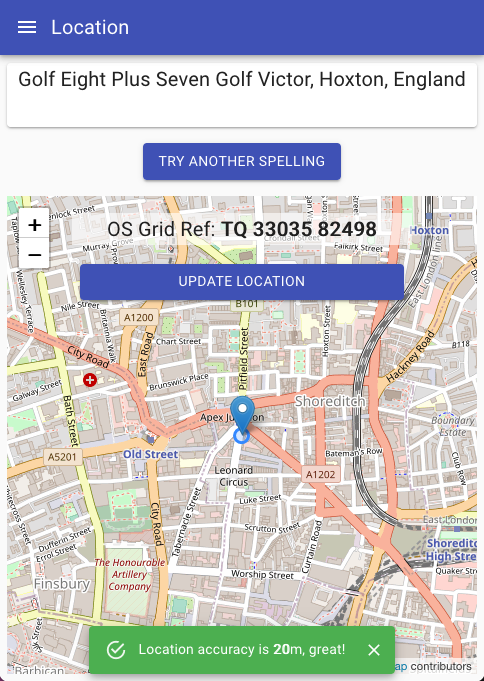

# locus-plus

Simple prototype web app which shortens and spells out the [Open Location Code](https://en.wikipedia.org/wiki/Open_Location_Code) for the current device location phonetically. This is mostly useless as there are any number of applications like SARLOC which send the location directly to an emergency response org, but apparently being able to communicate concise error free locations verbally is still a useful tool.

Try it at [locus.plus](https://locus.plus).

Designed to be used offine if required, it uses no external services to produce the code. It would be very simple to develop an inverse application which allows the displayed codes to be typed in and reverse the process to arrive at a lat/lon or OS grid reference, again without using any external services outside of this codebase.

It now includes a very simple "operator console" demo within the same app. Select "Operator Console" from the main menu to access this:

## TODO

This is a hack, there are some things wrong with it. It is starting to pick up a few Github issues, but as well as those, I know about the following:

 * Maybe Gaelic and welsh native names should be filtered out as primary placenames unless browser Locale indicates they would be useful.
 * Add Northern Ireland [Open PLace Name data](https://www.opendatani.gov.uk/).

## How

Based on OLC (Google maps Plus codes) spelt out onscreen phonetically. Problem is they get a little long and unwieldy and can therefore be error prone. Single digit errors could place the location many many miles away.

Thankfully the OLC spec allows a truncated code to be be used, along with a reference point. There is then more redundancy in the remaining digits and human error checking on the reference location which would be know to a local response operator is possible. This narrows the range of errors.

We process the [Ordnance Survey Open Names](https://www.ordnancesurvey.co.uk/business-government/products/open-map-names) data to convert from OSGB to WGS84 Lat/Lon and create an overlay with multiple reference locations spread as evenly as possible over the GB landmass. This gives short OLC codes without having to resort to online services like Google Maps which may not be available when the app is being used because data isn't available.

Most of the location munging is done in the utility class [Location](APIDefinitions.md) in `src/lib`

The UI for the project was bootstrapped with [Create React App](https://github.com/facebook/create-react-app).

A Progressive Web App serviceWorker allows the application to be used offline, but this does mean you need to take care about caching if developing locally as the usual serviceWorker persistence caveats apply.

## Available Scripts

In the project directory, you can run:

### `yarn start`

Runs the app in the development mode.\
Open [http://localhost:3000](http://localhost:3000) to view it in the browser.

The page will reload if you make edits.\
You will also see any lint errors in the console.

### `yarn test`

Launches the test runner in the interactive watch mode.\
See the section about [running tests](https://facebook.github.io/create-react-app/docs/running-tests) for more information.

### `yarn build`

Builds the app for production to the `build` folder.\
It correctly bundles React in production mode and optimizes the build for the best performance.

The build is minified and the filenames include the hashes.\
Your app is ready to be deployed!

See the section about [deployment](https://facebook.github.io/create-react-app/docs/deployment) for more information.

### `yarn eject`

**Note: this is a one-way operation. Once you `eject`, you can’t go back!**

If you aren’t satisfied with the build tool and configuration choices, you can `eject` at any time. This command will remove the single build dependency from your project.

Instead, it will copy all the configuration files and the transitive dependencies (webpack, Babel, ESLint, etc) right into your project so you have full control over them. All of the commands except `eject` will still work, but they will point to the copied scripts so you can tweak them. At this point you’re on your own.

You don’t have to ever use `eject`. The curated feature set is suitable for small and middle deployments, and you shouldn’t feel obligated to use this feature. However we understand that this tool wouldn’t be useful if you couldn’t customize it when you are ready for it.

## Learn More

You can learn more in the [Create React App documentation](https://facebook.github.io/create-react-app/docs/getting-started).

To learn React, check out the [React documentation](https://reactjs.org/).

### Code Splitting

This section has moved here: [https://facebook.github.io/create-react-app/docs/code-splitting](https://facebook.github.io/create-react-app/docs/code-splitting)

### Analyzing the Bundle Size

This section has moved here: [https://facebook.github.io/create-react-app/docs/analyzing-the-bundle-size](https://facebook.github.io/create-react-app/docs/analyzing-the-bundle-size)

### Making a Progressive Web App

This section has moved here: [https://facebook.github.io/create-react-app/docs/making-a-progressive-web-app](https://facebook.github.io/create-react-app/docs/making-a-progressive-web-app)

### Advanced Configuration

This section has moved here: [https://facebook.github.io/create-react-app/docs/advanced-configuration](https://facebook.github.io/create-react-app/docs/advanced-configuration)

### Deployment

This section has moved here: [https://facebook.github.io/create-react-app/docs/deployment](https://facebook.github.io/create-react-app/docs/deployment)

### `yarn build` fails to minify

This section has moved here: [https://facebook.github.io/create-react-app/docs/troubleshooting#npm-run-build-fails-to-minify](https://facebook.github.io/create-react-app/docs/troubleshooting#npm-run-build-fails-to-minify)
